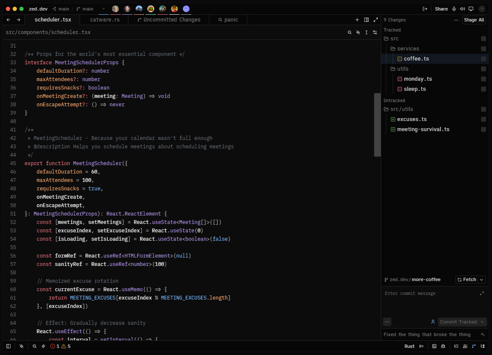
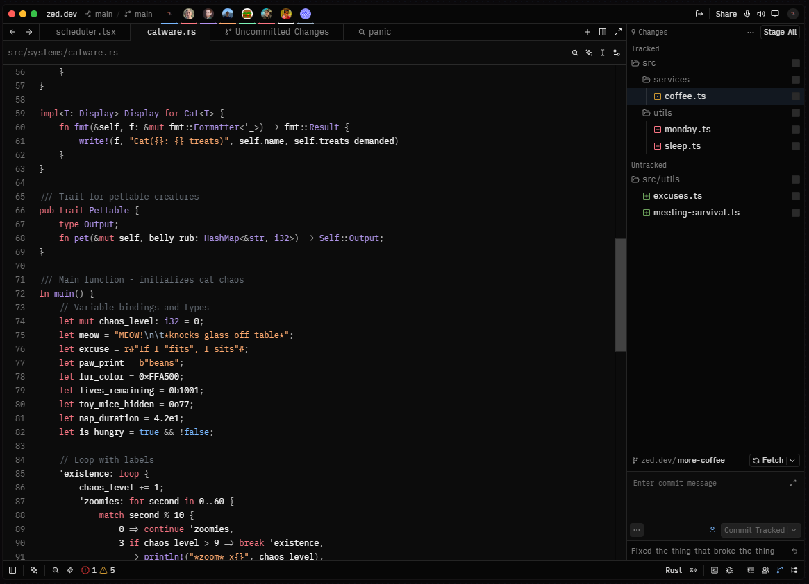
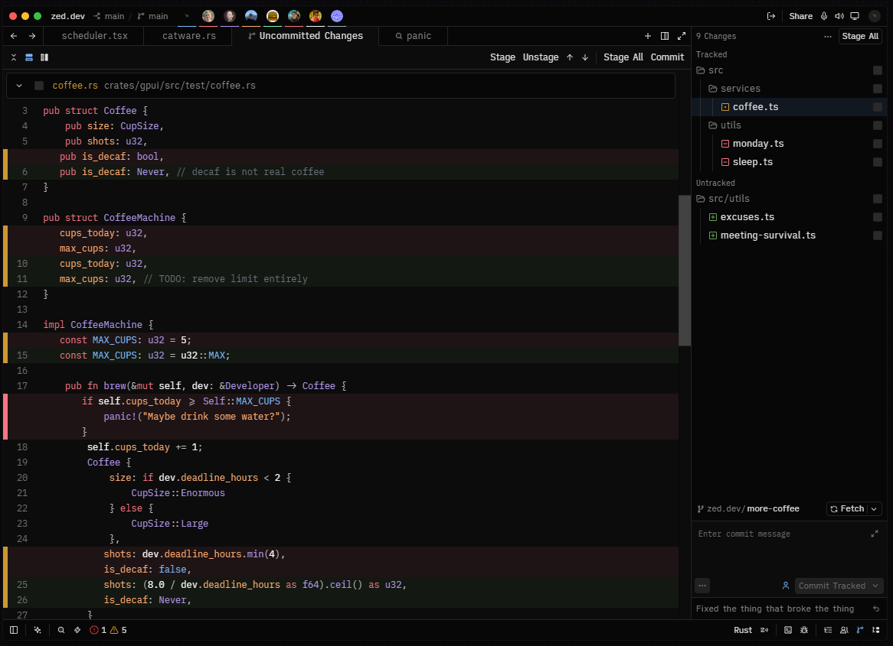
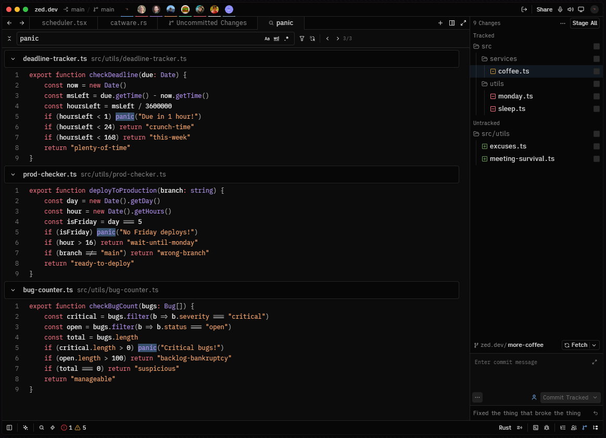

# Remix Min Darker (Zed)

A dark theme for [Zed](https://zed.dev) based on **Min Darker**: a darker background and contrast tweaks for everyday use.

## About

Palette adapted from the [Min Darker Theme](https://marketplace.visualstudio.com/items?itemName=gmsgarcia.min-darker-theme) (gmsgarcia) to Zed’s theme format.

## Screenshots

Showcase with **Remix Min Darker** theme applied.

## Development install

1. Open the Extensions panel (`Ctrl+Shift+X` on Windows/Linux, `Cmd+Shift+X` on macOS) or use the Command Palette.
2. Choose **Install Dev Extension** (`zed: install dev extension`).
3. Select this repository’s folder (the one that contains `extension.toml`).

Official docs: [Developing Extensions](https://zed.dev/docs/extensions/developing-extensions) · [Installing Extensions](https://zed.dev/docs/extensions/installing-extensions).

## License

MIT — see [LICENSE](LICENSE).

## Credits

- [Min Darker Theme](https://marketplace.visualstudio.com/items?itemName=gmsgarcia.min-darker-theme) — gmsgarcia
